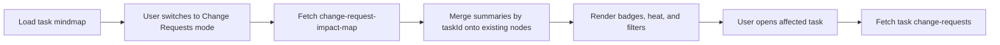

# Change Request Mindmap API Plan

## Purpose

Support a Change Requests mode on the existing project task mind map. The frontend should keep rendering the same task nodes and edges, but be able to overlay change-request badges, heat/intensity, status filters, and a task-scoped change-request side panel.

This should stay a projection over the canonical task and change-request tables. Do not create a separate change-request mind map model.

## Current Backend Fit

Existing APIs already cover the base experience:

- `GET /projects/:projectId/tasks/:taskId/mindmap`
- `GET /projects/:projectId/tasks/:taskId/change-requests`
- `GET /projects/:projectId/tasks/:taskId/change-requests/:changeRequestId`
- task change-request workflow actions under `tasks/:taskId/change-requests/:changeRequestId/...`

The mind map projection already supports `include=requests`, but the current request metadata is intentionally small:

```ts
counts: {
  openRequestCount: number;
  urgentRequestCount: number;
}
```

That is enough for simple badges, but not enough for a CR mode with status filtering, heat intensity, latest status, needs-my-attention, impact-type filters, or project/subtree-level totals.

## Recommended API Shape

Add one read-only projection endpoint:

```http
GET /projects/:projectId/tasks/:taskId/change-request-impact-map
```

This endpoint returns change-request summaries for the visible task subtree rooted at `taskId`.

It is separate from `GET /tasks/:taskId/mindmap` because:

- the frontend can load the normal mind map first
- CR mode can be fetched only when enabled
- CR filters can change without rebuilding the whole task projection
- the response can include richer CR-specific summaries without bloating normal mind map payloads

## Query Parameters

Reuse the subtree controls from `TaskMindmapQueryDto` where practical:

| Name | Type | Default | Description |
| --- | --- | --- | --- |
| `depth` | integer or `all` | same as mindmap | Descendant depth under the root task. |
| `limit` | integer | same as mindmap | Maximum task nodes considered. |
| `includeCompleted` | boolean | same as mindmap | Whether completed tasks are in scope. |
| `includeDeleted` | boolean | `false` | Admin/audit option. |
| `includeSuperseded` | boolean | `false` | Include superseded tasks. |
| `collapsedMode` | `respect` or `ignore` | `respect` | Match visible mind map behavior. |
| `status` | `ChangeRequestStatus` | optional | Filter CRs by workflow state. |
| `impactType` | `ChangeRequestImpactType` | optional | Filter by scope/cost/schedule/etc. |
| `priority` | `ChangeRequestPriority` | optional | Filter by priority. |
| `createdByUserId` | uuid | optional | Support "My requests". |
| `escalatedToUserId` | uuid | optional | Support escalated-to-me views. |
| `reviewerUserId` | uuid | optional | Support reviewer filters. |
| `needsMyAttention` | boolean | optional | Match existing CR list semantics. |
| `includeItems` | boolean | `false` | Include lightweight CR cards per task. |
| `itemLimitPerTask` | integer | `3` | Cap preview CRs per affected task. |

Create a new DTO, for example:

```ts
export class ChangeRequestImpactMapQueryDto extends TaskMindmapQueryDto {
  status?: ChangeRequestStatus;
  impactType?: ChangeRequestImpactType;
  priority?: ChangeRequestPriority;
  createdByUserId?: string;
  escalatedToUserId?: string;
  reviewerUserId?: string;
  needsMyAttention?: boolean;
  includeItems?: boolean;
  itemLimitPerTask?: number;
}
```

## Response Contract

```json
{
  "meta": {
    "projectId": "uuid",
    "rootTaskId": "uuid",
    "depth": "all",
    "limit": 500,
    "truncated": false,
    "collapsedMode": "respect",
    "filters": {
      "status": "UNDER_REVIEW",
      "impactType": null,
      "priority": null,
      "needsMyAttention": true
    },
    "generatedAt": "2026-08-07T10:00:00.000Z"
  },
  "summary": {
    "affectedTaskCount": 8,
    "total": 14,
    "open": 9,
    "final": 5,
    "escalated": 2,
    "needsMyAttention": 3,
    "critical": 1,
    "byStatus": {
      "NEW": 2,
      "UNDER_REVIEW": 5,
      "ESCALATED": 2,
      "APPROVED": 3,
      "REJECTED": 1,
      "RETURNED_FOR_REVISION": 1,
      "CANCELLED": 0
    },
    "byImpactType": {
      "SCOPE": 4,
      "COST": 2,
      "SCHEDULE": 5
    },
    "byPriority": {
      "LOW": 1,
      "MEDIUM": 5,
      "HIGH": 7,
      "CRITICAL": 1
    }
  },
  "data": {
    "taskSummaries": {
      "task-id": {
        "taskId": "task-id",
        "total": 3,
        "open": 2,
        "final": 1,
        "escalated": 1,
        "critical": 0,
        "needsMyAttention": 1,
        "latestStatus": "ESCALATED",
        "latestUpdatedAt": "2026-08-07T09:30:00.000Z",
        "intensity": "medium",
        "byStatus": {
          "UNDER_REVIEW": 1,
          "ESCALATED": 1,
          "APPROVED": 1
        },
        "byImpactType": {
          "SCHEDULE": 2,
          "COST": 1
        },
        "byPriority": {
          "HIGH": 3
        }
      }
    },
    "itemsByTaskId": {
      "task-id": [
        {
          "id": "change-request-id",
          "taskId": "task-id",
          "title": "Revise window schedule",
          "status": "ESCALATED",
          "impactType": "SCHEDULE",
          "priority": "HIGH",
          "createdById": "user-id",
          "escalatedToUserId": "user-id",
          "updatedAt": "2026-08-07T09:30:00.000Z"
        }
      ]
    }
  }
}
```

## Implementation Steps

1. Add DTOs

Create `src/tasks/dtos/change-request-impact-map-query.dto.ts`.

Export it from `src/tasks/dtos/index.ts`.

Use existing enums from `src/tasks/entities/change-request.entity.ts`. Use the same `toBoolean` and `toDepth` behavior as `TaskMindmapQueryDto`; if those helpers stay private, either move them to a small shared DTO utility or duplicate them deliberately for now.

2. Add a projection service

Create `src/tasks/services/task-change-request-impact-map.service.ts`.

Responsibilities:

- resolve the same visible subtree as the mindmap by calling `TaskQueryService.getTaskTree(...)`
- collect visible task IDs
- query `change_requests` once for aggregate rows grouped by `taskId`, `status`, `impactType`, and `priority`
- optionally query lightweight CR preview items when `includeItems=true`
- compute `intensity` from totals, for example:
  - `none`: `0`
  - `low`: `1`
  - `medium`: `2-4`
  - `high`: `5+` or any critical/escalated CR

3. Wire the service

Register the new service in `src/tasks/tasks.module.ts`.

Inject it into `src/tasks/tasks.service.ts` and expose:

```ts
getTaskChangeRequestImpactMap(
  projectId: string,
  taskId: string,
  query: ChangeRequestImpactMapQueryDto,
  requestUser: RequestUser,
  prefetchedMembership?: ProjectMembership | null,
)
```

This should verify project/task access through the same path used by task projections and require CR view permission at the controller level.

4. Add controller endpoint

In `src/tasks/tasks.controller.ts` add:

```ts
@Get('tasks/:taskId/change-request-impact-map')
@UseGuards(ProjectPermissionGuard)
@RequireProjectPermission('changeRequestManagement', 'view')
getTaskChangeRequestImpactMap(...)
```

Use a new success message such as `TASK_CHANGE_REQUEST_IMPACT_MAP_FETCHED`.

5. Keep drill-down unchanged

Do not duplicate full thread/message detail in the impact-map endpoint.

When the user opens a task from CR mode, the frontend should continue calling:

```http
GET /projects/:projectId/tasks/:taskId/change-requests?includeSummary=true&includeMessages=true
```

This preserves the current side-panel workflow and keeps the new endpoint fast.

6. Optionally extend the existing mindmap later

After the impact map exists, consider adding a richer include key to the existing mindmap projection:

```http
GET /projects/:projectId/tasks/:taskId/mindmap?include=...,requestImpact
```

This can merge `taskSummaries[taskId]` into each node as:

```ts
changeRequests?: MindmapChangeRequestSummary;
isChangeAffected?: boolean;
changeRequestIntensity?: 'none' | 'low' | 'medium' | 'high';
```

Treat this as a second phase. The separate endpoint is the cleaner MVP because it keeps normal mindmap payloads stable.

## Query Strategy

Use the current indexes first:

- `idx_change_requests_project_status`
- `idx_change_requests_task_status`
- `idx_change_requests_impact_type`
- `idx_change_requests_priority`
- `idx_change_requests_created_by`
- `idx_change_requests_escalated_to`

Main aggregate pattern:

```sql
SELECT
  task_id,
  status,
  impact_type,
  priority,
  COUNT(*) AS count,
  MAX(updated_at) AS latest_updated_at
FROM change_requests
WHERE project_id = :projectId
  AND task_id IN (:...taskIds)
  -- optional filters
GROUP BY task_id, status, impact_type, priority;
```

For `needsMyAttention`, reuse the same semantics from `TaskChangeRequestsService.applyNeedsMyAttentionScope(...)`. If keeping that method private causes duplication, extract the shared query scope into a small helper inside the change-request service layer.

## Permissions

Use:

- `taskManagement.view` to resolve visible task subtree behavior if the existing tree path requires it internally
- `changeRequestManagement.view` for the public impact-map endpoint

The controller should require `changeRequestManagement.view`. The service should avoid leaking CR summaries for tasks outside the verified project and subtree.

If the existing `TaskQueryService.getTaskTree(...)` requires task view permission internally, pass through the prefetched membership from `ProjectPermissionGuard` to avoid redundant project membership queries.

## Frontend Flow Supported



## Testing Plan

Add focused tests around:

- endpoint requires authentication
- endpoint requires `changeRequestManagement.view`
- root task must belong to the requested project
- summaries include only tasks in the requested subtree
- collapsed mode matches mindmap visibility
- status, impact type, priority, created-by, reviewer, escalated-to, and needs-my-attention filters work
- terminal statuses contribute to `final`
- open statuses contribute to `open`
- `ESCALATED` and `CRITICAL` affect intensity
- `includeItems=false` omits preview items
- `includeItems=true` returns capped lightweight items per task

## MVP Acceptance Criteria

- The frontend can fetch a normal mind map and then fetch CR impact data without N+1 task-level CR calls.
- Every affected task can display total/open/escalated/critical counts.
- CR mode can filter by status, priority, impact type, and needs-my-attention.
- Clicking a task still uses the existing task-scoped CR list/detail/thread APIs.
- No new persistence tables are required.
