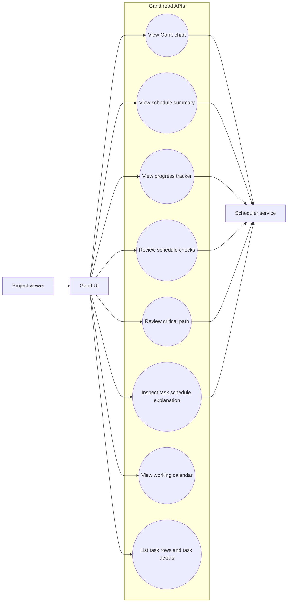
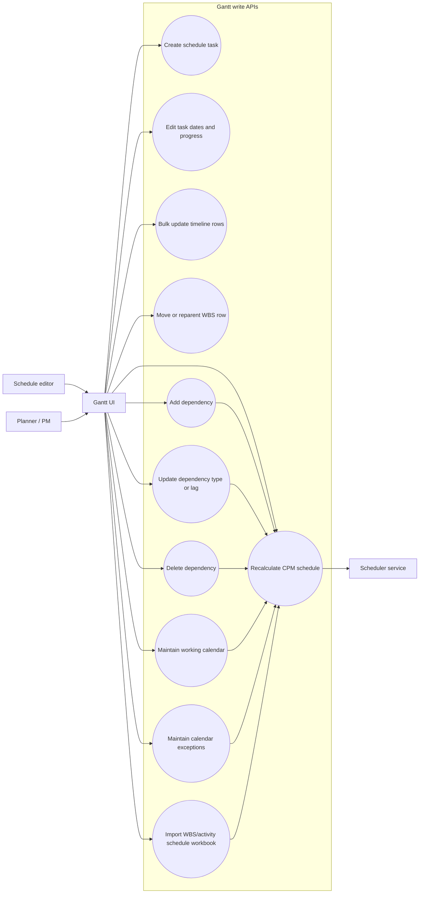
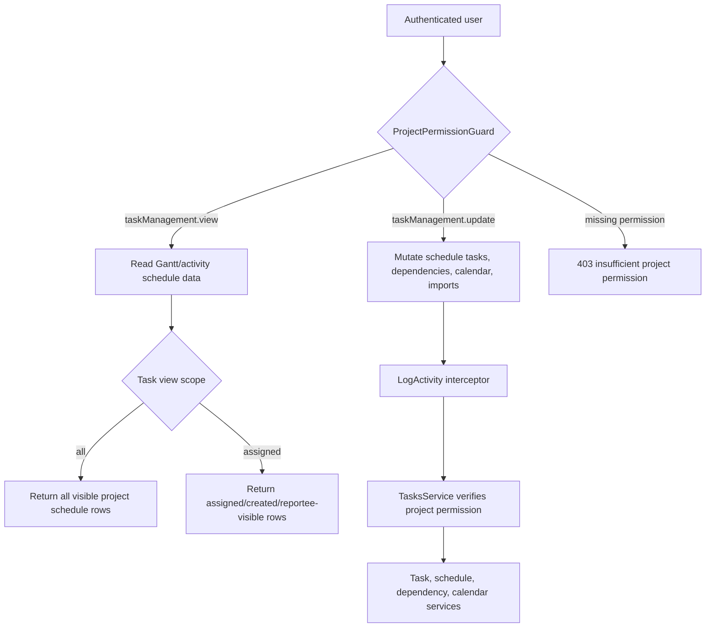
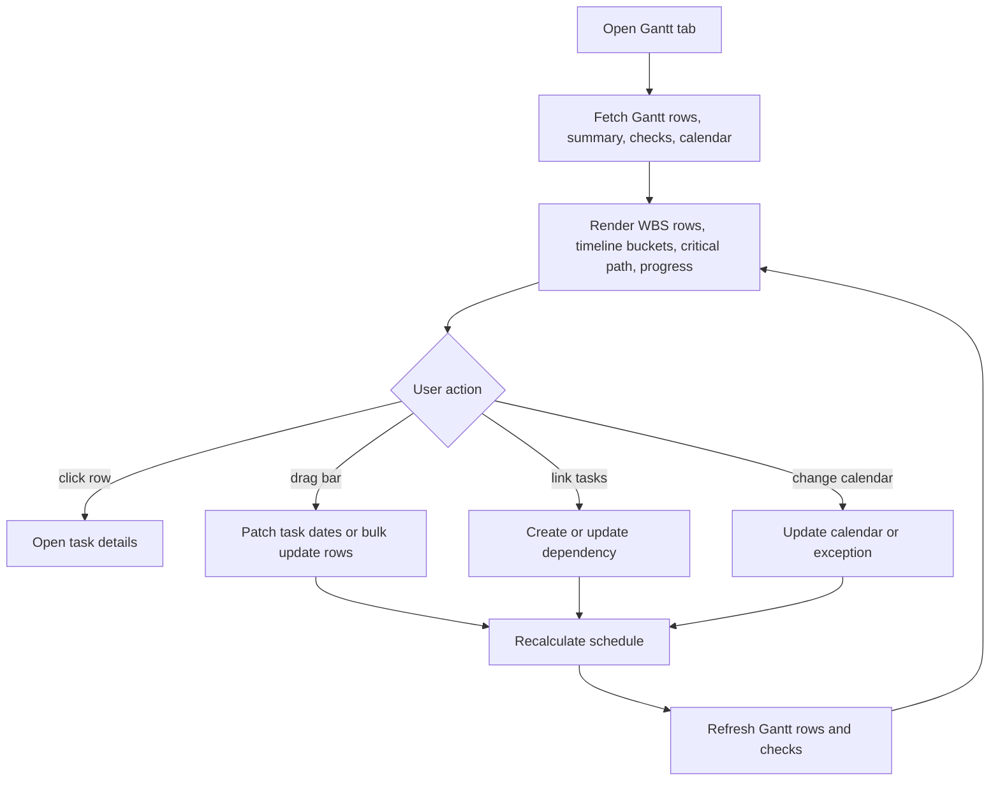

# Gantt API Use Case Diagrams

These diagrams describe the Gantt and activity schedule API surface exposed by `TasksController`.

## Actors

| Actor | Meaning |
| --- | --- |
| Project viewer | Authenticated project member with `taskManagement.view`. |
| Schedule editor | Project member with `taskManagement.update`. |
| Planner / PM | Schedule editor responsible for dates, dependencies, WBS, imports, and recalculation. |
| Gantt UI | Frontend chart/table consuming project task and activity schedule APIs. |
| Scheduler service | Backend service that builds Gantt rows, buckets, CPM fields, checks, and explanations. |

## Gantt Read Use Cases

## Gantt Maintenance Use Cases

## Permission And Audit Boundary

## Endpoint Map

| Use case | Method and path | Permission |
| --- | --- | --- |
| View Gantt chart | `GET /projects/:projectId/activity-schedule/gantt` | `taskManagement.view` |
| View schedule summary | `GET /projects/:projectId/activity-schedule/summary` | `taskManagement.view` |
| View progress tracker | `GET /projects/:projectId/activity-schedule/progress-tracker` | `taskManagement.view` |
| Review schedule checks | `GET /projects/:projectId/activity-schedule/checks` | `taskManagement.view` |
| Review critical path | `GET /projects/:projectId/activity-schedule/critical-path` | `taskManagement.view` |
| Export critical path | `GET /projects/:projectId/activity-schedule/critical-path/export` | `taskManagement.view` |
| Inspect task explanation | `GET /projects/:projectId/activity-schedule/explanations/:taskId` | `taskManagement.view` |
| View working calendar | `GET /projects/:projectId/activity-schedule/calendar` | `taskManagement.view` |
| List calendar exceptions | `GET /projects/:projectId/activity-schedule/calendar/exceptions` | `taskManagement.view` |
| List backing task rows | `GET /projects/:projectId/tasks` | `taskManagement.view` |
| Create schedule task | `POST /projects/:projectId/tasks` | `taskManagement.create` |
| Edit task dates/progress/Gantt metadata | `PATCH /projects/:projectId/tasks/:taskId` | `taskManagement.update` |
| Bulk timeline edits | `PATCH /projects/:projectId/tasks/bulk` | `taskManagement.update` |
| Move or reparent WBS row | `PATCH /projects/:projectId/tasks/:taskId/move` | `taskManagement.update` |
| Add dependency | `POST /projects/:projectId/tasks/:taskId/dependencies` | `taskManagement.update` |
| Update dependency | `PATCH /projects/:projectId/tasks/:taskId/dependencies/:depId` | `taskManagement.update` |
| Delete dependency | `DELETE /projects/:projectId/tasks/:taskId/dependencies/:depId` | `taskManagement.update` |
| Maintain working calendar | `PATCH /projects/:projectId/activity-schedule/calendar` | `taskManagement.update` |
| Create calendar exception | `POST /projects/:projectId/activity-schedule/calendar/exceptions` | `taskManagement.update` |
| Update calendar exception | `PATCH /projects/:projectId/activity-schedule/calendar/exceptions/:exceptionId` | `taskManagement.update` |
| Delete calendar exception | `DELETE /projects/:projectId/activity-schedule/calendar/exceptions/:exceptionId` | `taskManagement.update` |
| Import WBS/activity schedule workbook | `POST /projects/:projectId/activity-schedule/import` | `taskManagement.update` |
| Recalculate CPM schedule | `POST /projects/:projectId/activity-schedule/recalculate` | `taskManagement.update` |

## Primary User Journeys

