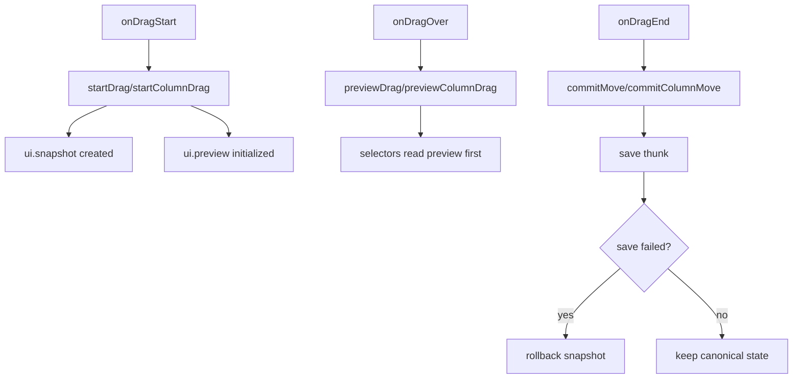

# Phase 0 Deliverable 2: Current State-Flow Diagram

## Current Flow (As-Is)

```mermaid
flowchart TD
  A[User opens Kanban route] --> B[Board mounts]
  B --> C[dispatch setActiveScope + fetchKanbanBoard]
  C --> D[Selectors derive board, columns, tasks, filters]

  D --> E[User clicks task row]
  D --> F[User clicks subtask row]

  E --> G[setSelectedSubtaskId(null)]
  G --> H[setSelectedTaskId(taskId)]

  F --> I[setSelectedSubtaskId(subtaskId)]
  I --> J[setSelectedTaskId(taskId)]

  H --> K[TaskDetailsSheet open=true with parent task]
  J --> K

  K --> L[Sheet focuses/highlights selected subtask node]
  L --> M[User closes sheet]
  M --> N[setSelectedTaskId(null) + setSelectedSubtaskId(null)]
```

## Data/Action Flow Notes

- Board-local selection state exists only in component state, not Redux (`selectedTaskId`, `selectedSubtaskId`). Reference: `modules/kanban/components/board.component.tsx:234`.
- Open-task handlers are inline closures passed to columns. Reference: `modules/kanban/components/board.component.tsx:972`.
- Detail is rendered as a right-side `Sheet`, not route/view replacement. Reference: `modules/kanban/components/task-details-sheet.component.tsx:562`.
- Subtask click does not switch to a subtask detail entity; it opens parent task and scrolls to subtask in focus mode. Reference: `modules/kanban/components/task-details-sheet.component.tsx:501` and `modules/kanban/components/task-details-sheet.component.tsx:530`.

## Current Drag/Preview State Flow (As-Is)



## Phase 1 Integration Boundary (What will change)

- Replace local `selectedTaskId/selectedSubtaskId` with centralized navigation state (`currentTaskId`, `navigationStack`, breadcrumb selectors).
- Replace Sheet-oriented focus mode with in-place detail replacement navigation.
- Keep drag/preview flow intact and independent from navigation stack changes.
